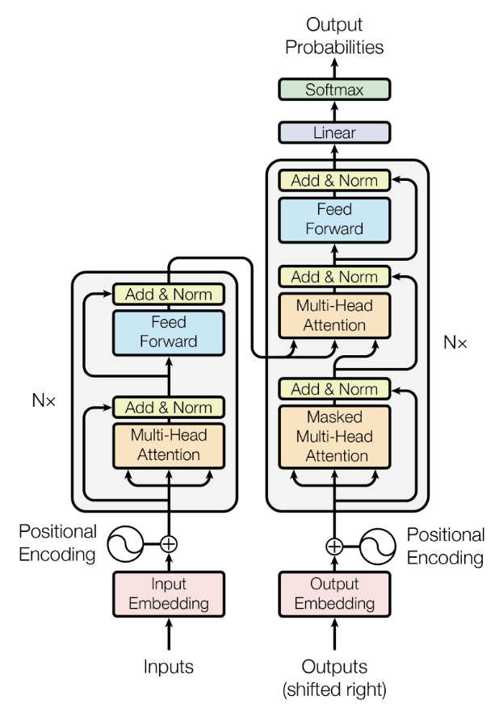

# AI Explainled: Transformer from scratch

Implementation of Transformer from the paper: "Attention is all you need".

This repo belong to a series called **AI Explained**, where I implement well-known AI/ML architectures (Transformer, Vision Transformer, ...) from scratch. The goal is to gain profound understanding of these architectures by implementing, improving from scratch or upon existing explanations and refining my knowledge.

Thanks to **Umar Jamil** for his clear explanation on Transformer 👍

## Environment setup

To install all required dependencies, following the instructions in `SETUP.md` .

## Architecture

